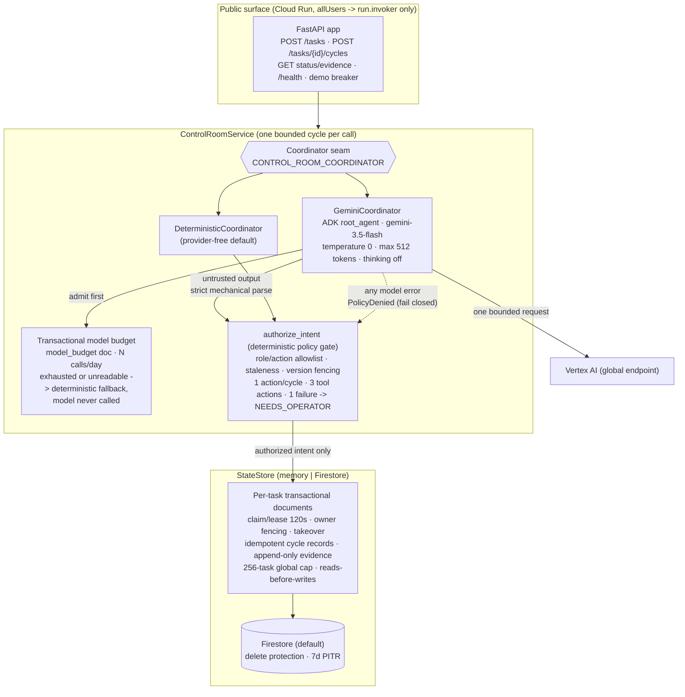
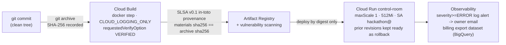

# Control Room — Architecture

Control Room is a fail-closed control plane for long-horizon agents: every cycle
of agent work is proposed, policy-authorized, executed once, and durably
recorded — or it does not happen at all. The public demo serves synthetic data
only.

## Runtime architecture

Key properties:

- **Model output is untrusted input.** The Gemini coordinator strict-parses the
  response into a bounded choice (action + opaque token), rebuilds every
  infrastructure field locally, and the result still passes the same
  `authorize_intent` gate as the deterministic path. A malformed or failed model
  response persists `NEEDS_OPERATOR` — progress is never fabricated.
- **Anonymous callers cannot amplify cost.** Task creation is capped by a
  transactional 256-task counter; model calls are capped by a transactional
  daily budget document; every task is capped at 3 tool actions and 1 failure.
- **Exactly-once cycles under real concurrency.** Cycle claims carry a 120-second
  lease with owner fencing; expired claims are taken over atomically and a
  crashed worker's bound intent is replayed, not re-invented. An opt-in
  integration suite replays these paths against the real Firestore emulator,
  which also machine-enforces the reads-before-writes transaction discipline.
- **Privacy-minimized evidence.** Evidence and batons carry metadata-only
  references (opaque tokens, no bodies); verification of a `PASS` requires a
  distinct registered verifier with per-check verification evidence.

## Build and deployment provenance

The audit ledger (kept outside the repository) records every cloud mutation:
build IDs, source-archive SHA-256s, image digests, deploy revisions, IAM state,
and metadata (never bodies) of each bounded model request.
